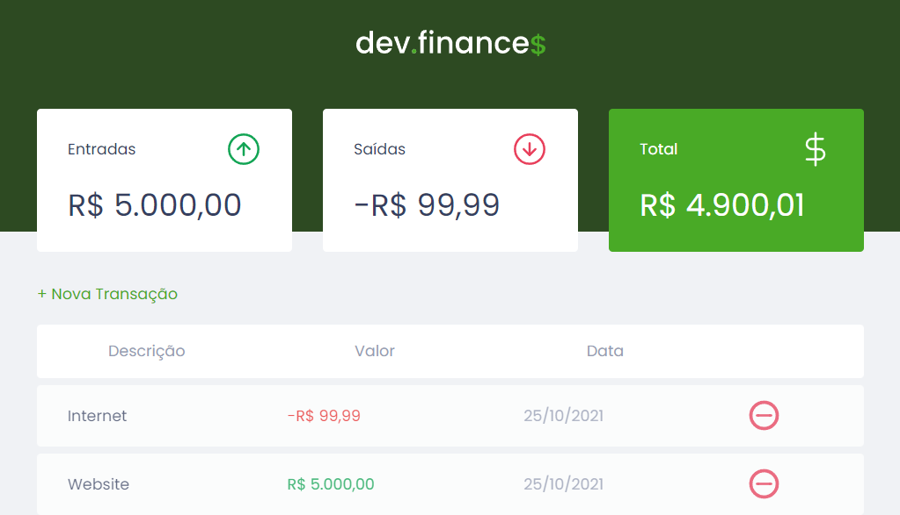

<div align="center">
  <div>
    <h1>Dev.finance$</h1>
    <p>
      <a href="#-status">Status</a> •
      <a href="#-features">Features</a> •
      <a href="#%EF%B8%8F-prerequisites">Prerequisites</a> •
      <a href="#-applied-technologies">Applied technologies</a> •
      <a href="#-author">Author</a> •
      <a href="#-readme-versions">README versions</a>
    </p>
    
  </div>

  <div>
    
    <a href="https://my-devfinances.netlify.app/">
      </a>
    
  </div>
</div>

<hr>

### 🏁 Status

<h3 align="center">
  🎉 Dev.finance$ ✔️ Finished 🎉
</h3>

<hr>

### 🏆 Features

- [x] Add new transactions, which must have a description, value - which can be positive (income) or negative (expense) - and date;
- [x] Format the value of transactions;
- [x] Cancel addition of new transaction;
- [x] Save transactions on localStorage and retrive them when the application is reloaded;
- [x] Delete transactions; and
- [x] Update balance information (income, expenses and total) with each new transaction / deletion.

<hr>

### ❗️ Prerequisites

Hey Dev, before starting your tests and / or contributions in the application, you will need to have the wonderful [GIT](https://git-scm.com) and a good text editor installed.

Well, having everything ready and installed, we can proceed to the step by step of how to run the application.

### 🕹️ Running the application

```bash
# First of all, clone this repo using GIT
$ git clone <https://github.com/ThiagoBrito-Dev/devfinances>

# Access the project folder from the command terminal
$ cd .../devfinances

# Finally, open the "index.html" file in your browser, or using the Live Server extension, if you have it installed.
```

<hr>

### 🔮 Applied technologies

- [HTML](https://devdocs.io/html/)
- [CSS](https://devdocs.io/css/)
- [JavaScript](https://devdocs.io/javaScript/)

<hr>

### 👨🏽‍🎓 Author

<div align="center">
  

  <br />

  <div>
    <h3>
      🤝 Thiago Raniery Brito
    </h3>
    <p>Hey Dev, did you like the application? Well, if you want, feel free to get in touch with me for here or through the tags below.</p>
  </div>
  
  <div>
    <a href="https://www.linkedin.com/in/thiagoranierybrito/">
      </a>
    <a href="mailto:thiagobritotrs@gmail.com">
      </a>
  </div>
</div>

<hr>

### 📚 README versions

<div>
  <a href="https://github.com/ThiagoBrito-Dev/devfinances/blob/main/README.md">Portuguese (pt-br)</a>
  |   
  <a href="https://github.com/ThiagoBrito-Dev/devfinances/blob/main/README-en.md">English (en-us)</a>
</div>
